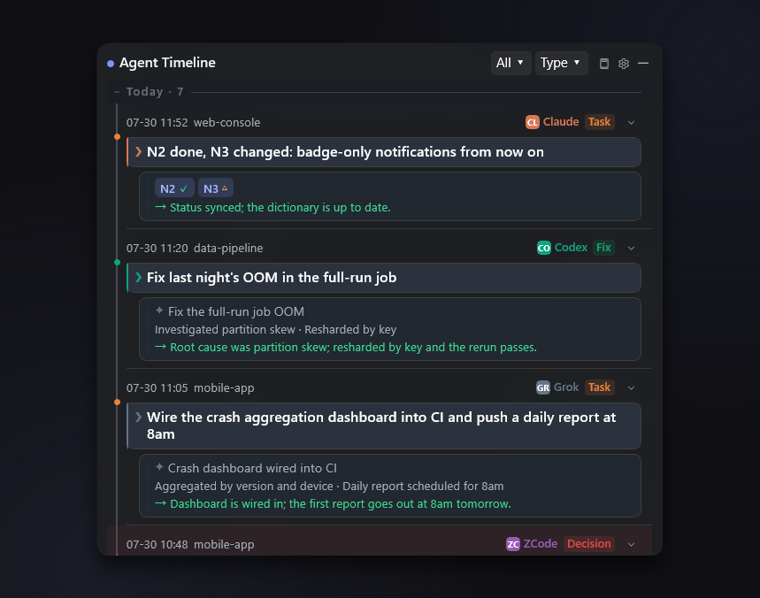
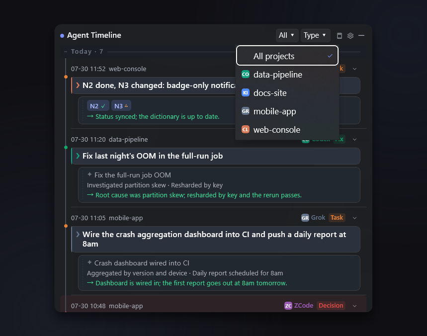
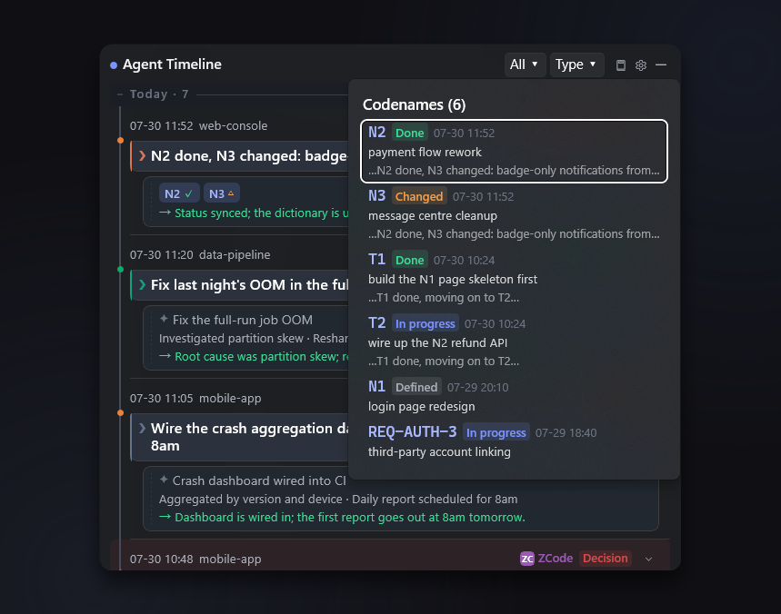
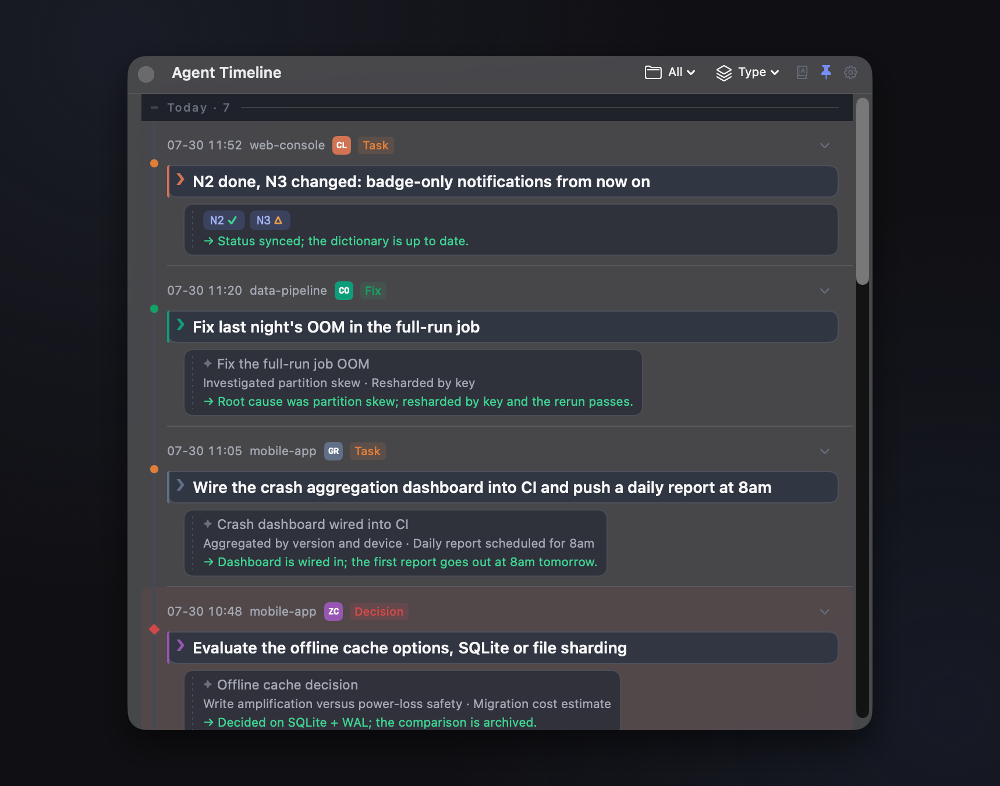
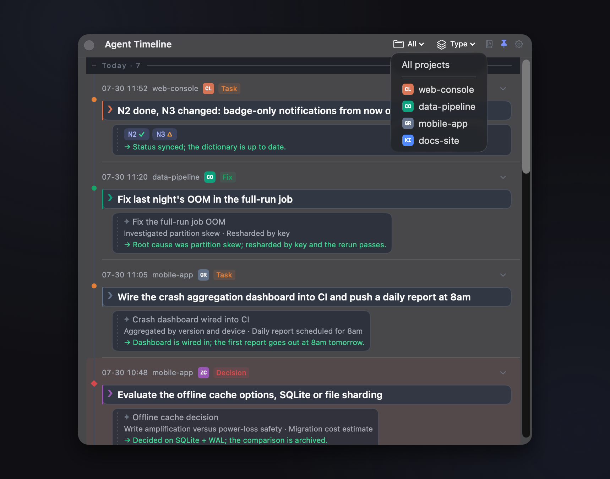
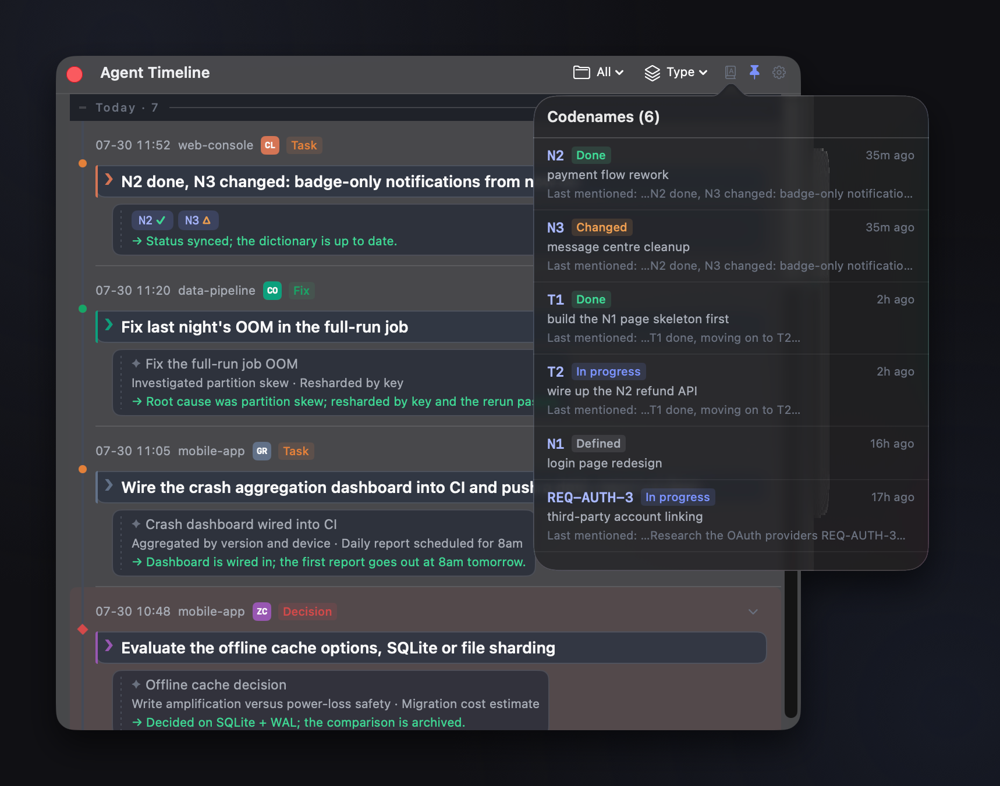
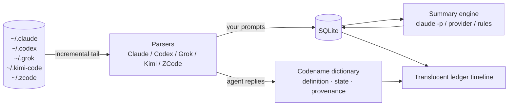

<div align="center">


# Agent Timeline

**A translucent desktop widget that keeps every prompt you ever sent an AI agent one glance away**

[中文](README.md) · **English**

[](https://github.com/surebeli/agent-timeline/actions/workflows/ci.yml)


[](LICENSE)


</div>

---

If you run long tasks through agent CLIs — Claude Code, Codex, Grok Build, Kimi Code, ZCode — you have had this moment:

> You numbered the work items N1, N2, N3… in the conversation. Hours later the agent reports **"N2 done"**.
> Wait — which one was N2? Scroll back through tens of thousands of lines of session log? Not happening.

**Agent Timeline** tails your local agent session files in real time, turns **every prompt you submitted** into a timeline entry, and keeps **your task codenames** in a dictionary that maintains itself — so when you forget, it's one click away.

## What it does

| | |
|---|---|
| 🤝 **Five agents, one timeline** | Claude Code · Codex · Grok Build · Kimi Code · ZCode interleaved, with source badges (CL/CO/GR/KI/ZC) and per-project filtering. The two platforms' parsers are **semantically identical line for line** — the same corpus yields the same entries on macOS and Windows |
| 🕰 **Prompt timeline** | Each prompt of yours is one entry (newest on top), with an LLM-distilled title, key points, and a one-line outcome. Filter by kind: requirement · task · research · learning · decision · fix |
| 📖 **Codename dictionary** | Definitions like `N1: login redesign` register themselves (mined from both your prompts and the agent's replies). Phrases like `N2 done` or `T1 finished, moving on to T2` advance the state automatically (✓ done / ▶ in progress / △ changed). Click any codename to jump back to where it was defined |
| 🫧 **Dual-ink ledger** | `❯ + solid colored ink line + paper block` = your words. `✦ + dashed grey ink line` = the machine's. When the window fades out, the only thing still legible on screen is what *you* said |
| 🪟 **Built like a widget** | Lives in the menu bar (macOS) or tray (Windows). ~95% opaque on hover, ~25% when unfocused so it stays out of the way; fast fade-in, slow fade-out. Always-on-top toggle, never steals focus, full text selection and copy, and self-stabilizing contrast over any wallpaper (scrim + hairline) |
| 🌏 **Four UI languages** | Simplified Chinese · English · Japanese · Korean, switchable in Settings and applied instantly. Recognition of status keywords and task kinds works across all four **simultaneously** — a Chinese UI still understands a Japanese agent reply. Stored history keeps the language it was written in |
| 🔌 **Zero-config summaries** | Reuses your local `claude -p` headless by default (`codex exec` as fallback). Point it at any OpenAI-compatible provider instead if you prefer. When no model is reachable it degrades to rule-based summaries rather than going blank |
| 🔒 **Local first** | Session parsing, storage (SQLite), and the dictionary are entirely local. The only outbound requests come from summarization |

## Getting started

### Download a build

[**Releases**](https://github.com/surebeli/agent-timeline/releases) carries both platforms (CI builds them on every `v*` tag):

- `AgentTimeline-macos-vX.Y.Z.zip` — unzip to get the `.app`, drop it in `/Applications`;
- `AgentTimeline-windows-x64-vX.Y.Z.zip` — unzip anywhere and run `AgentTimeline.exe`
  (Windows App SDK is self-contained; you need the .NET 8 Desktop Runtime).

The single source of truth for the version is [`VERSION`](VERSION) at the repo root; the release
procedure is documented at the top of [CHANGELOG.md](CHANGELOG.md).

### macOS (Swift + SwiftUI + AppKit, no third-party dependencies)

```bash
cd macos
scripts/build-app.sh release              # produces macos/dist/AgentTimeline.app
cp -R dist/AgentTimeline.app /Applications/
open /Applications/AgentTimeline.app      # look for the ⏱ clock icon in the menu bar
swift test                                # 81 tests
```

### Windows (WinUI 3 / .NET 8)

Full source lives in [`windows/`](windows/) and has been **verified on real hardware**: the
cross-platform Core layer passes 400 smoke assertions, and the WinUI layer clears a hard
VS-msbuild gate in CI. Per-item verification notes are in
[windows/DEBUG-PLAYBOOK.md](windows/DEBUG-PLAYBOOK.md). For development, open
`windows/AgentTimeline.sln` in Visual Studio 2022 — see [windows/README.md](windows/README.md).

#### Windows in the wild

| Dual-ink ledger · kind accents · codename badges | Project dropdown · most-recent-agent badges | Codename dictionary · a lifecycle at a glance |
|:---:|:---:|:---:|
|  |  |  |

Settings (three summary engines / opacity / per-agent toggles):
[screenshot-windows-settings.png](docs/assets/screenshot-windows-settings.png).

#### macOS in the wild

| Dual-ink ledger · kind accents · codename badges | Project dropdown · most-recent-agent badges | Codename dictionary · a lifecycle at a glance |
|:---:|:---:|:---:|
|  |  |  |

Settings: [screenshot-macos-settings.png](docs/assets/screenshot-macos-settings.png).

> Both rows are shot from the same demo dataset ([docs/DEMO-DATASET.md](docs/DEMO-DATASET.md)),
> with the same dip geometry and the same backplate, so the two rows line up exactly.
> macOS was captured at v0.5.1 on a Retina display (2×, 1718×1352); Windows was recaptured at
> v0.6.0 on a 100%-scaled display (859×676 — identical dip geometry, half the pixel density).
> At the 290px width used above the two look the same. Capture scripts:
> `macos/scripts/shots/` and `windows/scripts/shots/`.
>
> **Language of the screenshots.** The demo dataset exists in Chinese and English, and the capture
> script takes the language as an explicit input, so this page shows the **English** UI with English
> sample data — the Windows row above is `…-en.png`. The **macOS row and the hero image at the top
> still show the Chinese UI**: they can only be recaptured on a Mac, and doing so is queued for the
> macOS side. The hero image is additionally out of date on both pages — it shows a filter labelled
> 「阶段」, which was renamed to 「类型」 (kind) in an earlier round.

## How it works



- **Incremental parsing** — tails by byte offset, so a restart neither re-reads nor drops lines.
  Each vendor's session format is specified in [docs/SESSION-FORMATS.md](docs/SESSION-FORMATS.md).
- **One source of truth across platforms** — the visual spec lives in
  [design/design-tokens.json](design/design-tokens.json) (embedded into the binary at build time on
  macOS, generated into XAML resources on Windows) and UI copy lives in
  [design/strings.json](design/strings.json) (69 keys × 4 languages). CI fails the build if either
  copy drifts.
- Product requirements: [docs/PRD.md](docs/PRD.md) · architecture:
  [docs/ARCHITECTURE.md](docs/ARCHITECTURE.md) · changes: [CHANGELOG.md](CHANGELOG.md)

## Settings

Menu-bar / tray icon → Settings: summary engine (local CLI or a custom provider), UI language,
the two opacity levels, always-on-top, backfill window, and a toggle per agent. Session paths for
each vendor are **discovered automatically** and deliberately not configurable — a path is a fact
about the product, not a user preference. Formats are specified in
[docs/SESSION-FORMATS.md](docs/SESSION-FORMATS.md).

## Roadmap

- **M2** — namespace codenames per project (so identical short codes in different projects stay
  separate), search, and a dictionary management UI
- ~~**M3** — real-hardware debugging on Windows and cross-platform visual sign-off~~ ✅ done
  (2026-07-26; 11 fixes found on real hardware, every checklist item annotated)
- ~~**M4** — bring the macOS zcode parser in line, strip Codex skill-echo paths~~ ✅ done
  (2026-07-28); a few real-mouse interaction items remain for attended retest
- ~~**M4.5** — four-language UI and recognition tables, both platforms in the same round~~ ✅ done
  (2026-07-30)
- **M5** — rich-text rendering for outcome details (code blocks / tables / clickable links, i.e.
  [TEXT-NORMALIZATION Phase D](docs/TEXT-NORMALIZATION.md)).
  **Blocked on** adding a `nodes.full_text` column: L2 normalization is lossy and agent replies
  aren't currently stored verbatim, so historical entries have no source to fall back on. That same
  column would also unlock "read the full reply from the outcome line" and verbatim codename replay
  (§5.2-1). Scheduled after M2 because three-stage progressive disclosure already takes the edge off
  "I can't see all of it", while adding a column is an irreversible storage commitment better
  decided together with the search work.

## A note on the docs

This README and its Chinese counterpart are kept in sync. The deep-dive documents under
[`docs/`](docs/) — PRD, architecture, session-format specs, the text-normalization spec, the debug
playbook — are **written in Chinese only**. They are engineering records rather than user-facing
docs; if you need one of them in English, open an issue and say which.

## License

[MIT](LICENSE) © litianyi
