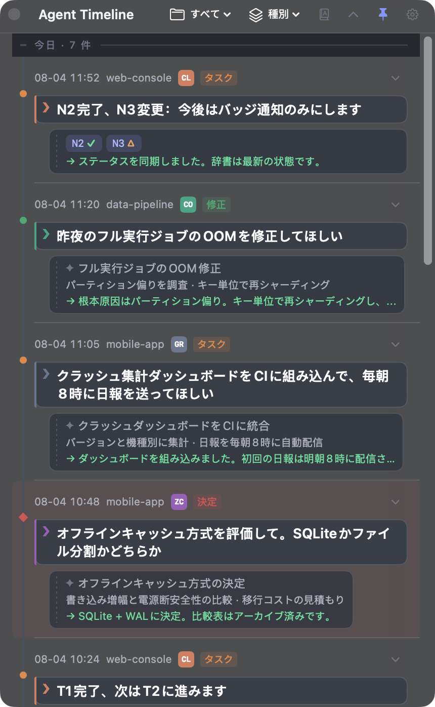
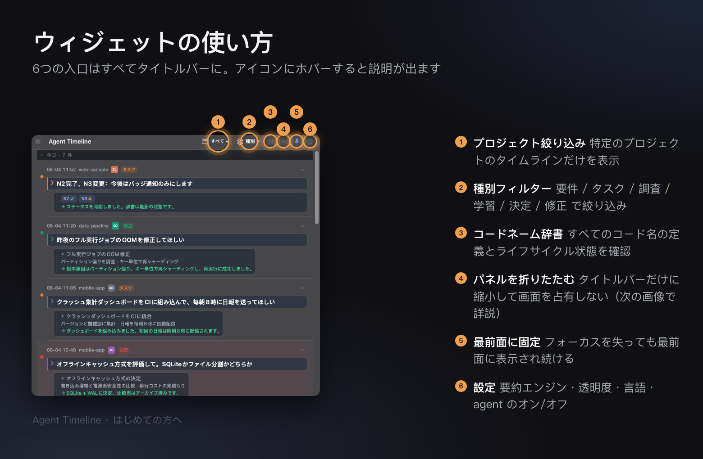
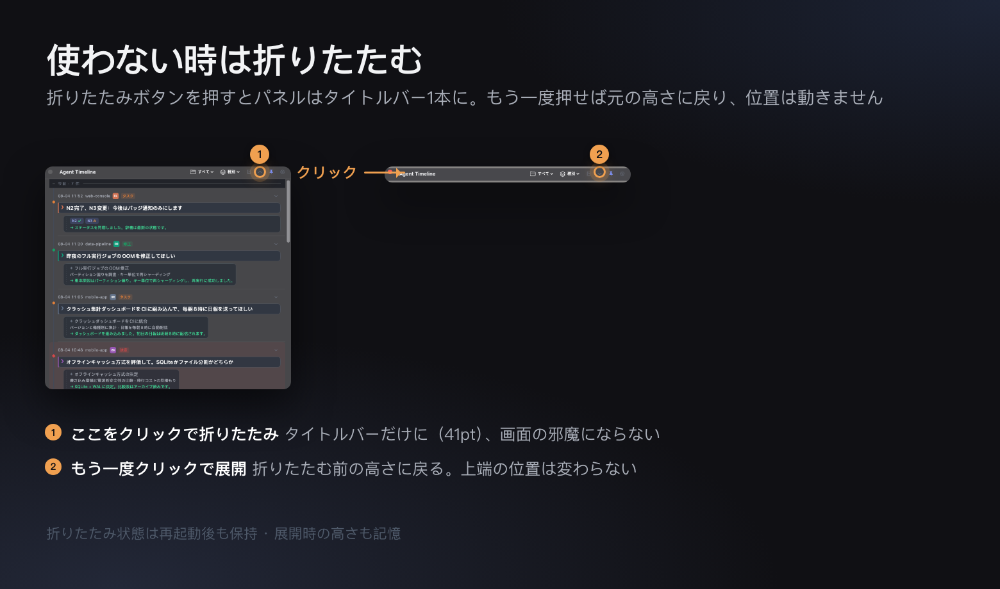
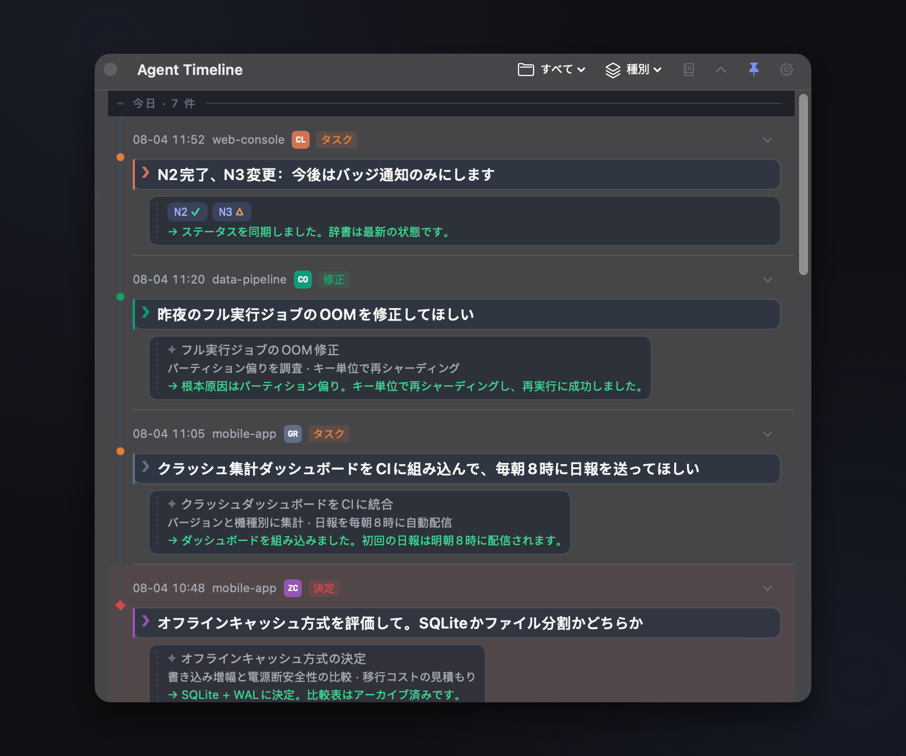
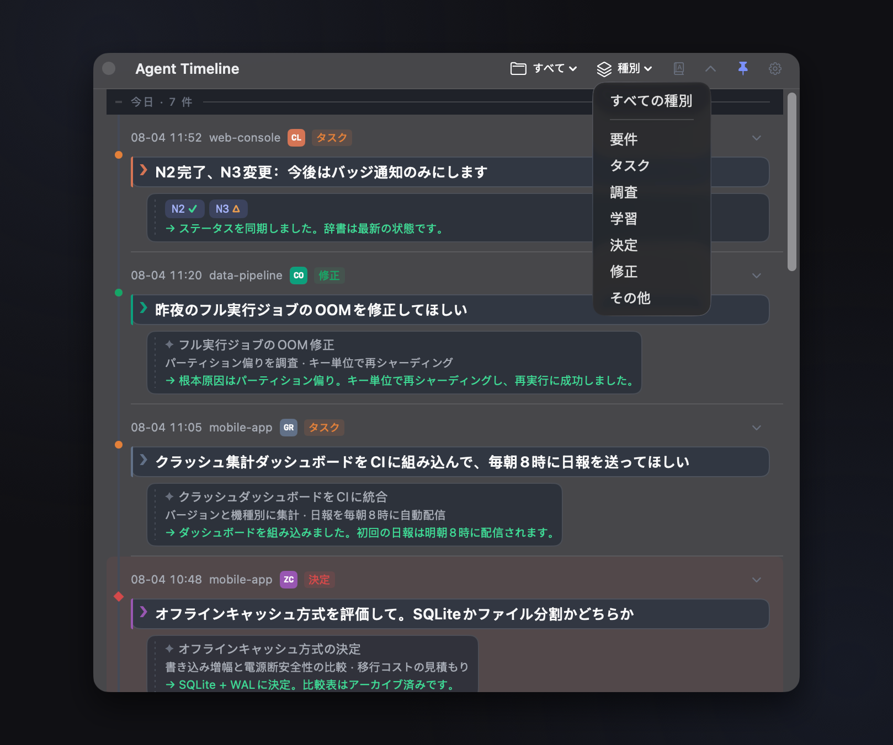
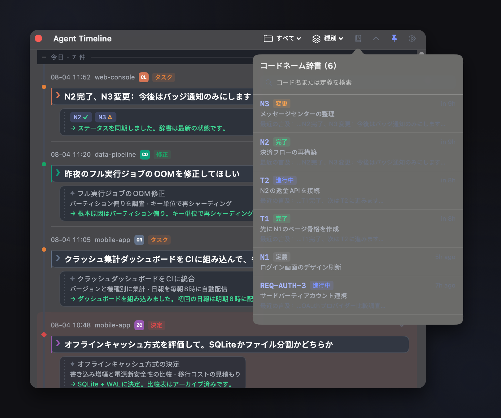
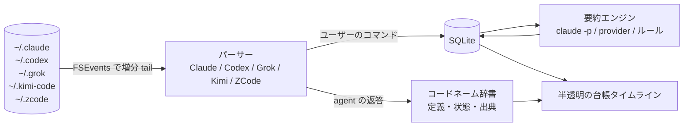

<div align="center">


# Agent Timeline

**デスクトップに常駐する半透明タイムラインウィジェット — 長期にわたる AI コーディングセッションで「自分が言ったこと」をいつでも遡れるように**

[中文](README.md) · [English](README.en.md) · **日本語** · [한국어](README.ko.md)

[](https://github.com/litianyi-007/agent-timeline/actions/workflows/ci.yml)


[](LICENSE)



</div>

---

Claude Code / Codex / Grok Build / Kimi Code / ZCode といった agent CLI で長期タスクを回していると、必ずこうなります：

> セッション中に要件を N1、N2、N3… と番号付けした。数時間後、agent が **「N2 完了」** と言う —— N2 って何だっけ？
> 何万行もの session ログを遡る？やめておこう。

**Agent Timeline** はローカルの agent session ファイルをリアルタイムに追跡し、**あなたが送信したすべてのコマンド**をタイムラインのノードに整理して、**タスクのコードネーム**を自動メンテナンスされる辞書にまとめます —— 忘れたらクリックするだけ。

## はじめての方へ

<div align="center">





</div>

## 主な機能

| | |
|---|---|
| 🤝 **5つの agent を1本のタイムラインに** | Claude Code · Codex · Grok Build · Kimi Code · ZCode をまとめて表示。ソースバッジ（CL/CO/GR/KI/ZC）とプロジェクト絞り込み付き。**両プラットフォームのパーサーは1行ずつ同じ意味論**で、同じ素材から同じノードを生成します |
| 🕰 **コマンドのタイムライン** | あなたの発言1つ = 1ノード（最新が上）。LLM がタイトル / 要点 / 実行結果を1行に要約。要件・タスク・調査・学習・決定・修正 で分類・絞り込み |
| 📖 **コードネーム辞書** | `N1: ログイン改修` 形式の定義を自動登録（コマンドと agent の返答、両方から）。`N2完了`、`T1 完了、次は T2` で状態を自動遷移（✓完了 / ▶進行中 / △変更）。**キーワード検索**でコード名・定義・直近の言及をまとめて検索。クリックで定義と出典を確認 |
| 🫧 **二重インクの台帳** | `❯ + 実線のカラーインク + 紙面ブロック` = あなたの発言、`✦ + 破線のグレーインク` = マシンの発言 —— フォーカスを失って半透明になったとき、画面上で唯一はっきり読めるのがあなたの言葉です |
| 🪟 **ウィジェットとしての窓** | メニューバー / トレイに常駐。ホバー時 ≈95% で読みやすく、非フォーカス時 ≈25% で邪魔にならない（速いフェードイン・ゆっくりしたフェードアウト）。最前面固定の切り替え、クリックしてもフォーカスを奪わない、全文の選択とコピー、明暗どちらの背景でもコントラストを自動で保つ（scrim + 輪郭線） |
| 🗂 **タイトルバーに折りたたむ** | ヘッダーの chevron を1回押すとタイトルバーだけに、もう1回で元の高さに戻る。**上端は動かず**ロールスクリーンのよう。折りたたみ中は縦サイズをロック（ドラッグ不可）、状態と折りたたみ前の高さは再起動後も保持 |
| 🌏 **4言語 UI** | 简体中文 · English · 日本語 · 한국어。設定から切り替えると**即座に反映**。状態キーワードと種別の認識は**4言語すべて常時有効** —— 日本語 UI のままでも中国語の agent の返答を理解します。保存済みの履歴は元の言語のまま書き換えません |
| 🔌 **設定不要の要約** | 既定でローカルの `claude -p`（代替は `codex exec`）を headless で再利用。任意の OpenAI 互換 provider に差し替え可能。LLM が使えないときはルールベースに縮退して止まりません |
| 🔒 **ローカル優先** | session の解析・保存（SQLite）・辞書はすべてローカル。外部へのリクエストは要約呼び出しのみ |

## クイックスタート

### ビルド済みパッケージ

[**Releases**](https://github.com/litianyi-007/agent-timeline/releases) に両プラットフォームの成果物があります（`v*` タグを push すると CI が自動ビルド）：

- `AgentTimeline-macos-vX.Y.Z.zip` — 展開して `.app` を `/Applications` へ；
- `AgentTimeline-windows-x64-vX.Y.Z.zip` — 任意のディレクトリに展開して `AgentTimeline.exe` を実行
  （Windows App SDK は自己完結。.NET 8 デスクトップランタイムが必要）。

バージョンの唯一の情報源はリポジトリ直下の [`VERSION`](VERSION)。リリース手順は [CHANGELOG.md](CHANGELOG.md) の冒頭を参照してください。

### macOS（Swift + SwiftUI + AppKit、サードパーティ依存ゼロ）

```bash
cd macos
scripts/build-app.sh release              # macos/dist/AgentTimeline.app を生成
cp -R dist/AgentTimeline.app /Applications/
open /Applications/AgentTimeline.app      # メニューバーの時計アイコン ⏱
swift test                                # 106 件のユニットテスト
```

### Windows（WinUI 3 / .NET 8）

ソース一式は [`windows/`](windows/) にあり、**実機での動作確認済み**です：Core 解析層はクロスプラットフォームのスモークテスト 463 アサーションを通過、WinUI 層は CI の VS msbuild ハードゲートを通過しています。レイヤーごとの検証チェックリストは [windows/DEBUG-PLAYBOOK.md](windows/DEBUG-PLAYBOOK.md)（中国語）を参照。開発ビルドは Visual Studio 2022 で `windows/AgentTimeline.sln` を開いてください。詳細は [windows/README.md](windows/README.md)。

#### Windows 実機スクリーンショット

| 二重インクの台帳 · 種別カラー · コードネーム状態バッジ | プロジェクトのドロップダウン · 直近アクティブな agent バッジ | コードネーム辞書 · ライフサイクルを一画面で |
|:---:|:---:|:---:|
|  |  |  |

設定画面（要約エンジン3種 / 透明度 / agent のオンオフ）：[screenshot-windows-settings.png](docs/assets/screenshot-windows-settings.png)。

#### macOS 実機スクリーンショット

| 二重インクの台帳 · 種別カラー · コードネーム状態バッジ | プロジェクトのドロップダウン · 直近アクティブな agent バッジ | コードネーム辞書 · ライフサイクルを一画面で |
|:---:|:---:|:---:|
|  |  |  |

設定画面：[screenshot-macos-settings-ja.png](docs/assets/screenshot-macos-settings-ja.png)。両プラットフォームとも同じデモデータセット（[docs/DEMO-DATASET.md](docs/DEMO-DATASET.md)、中国語）で撮影し、ビジュアル仕様は `design/design-tokens.json` に同期しています。

> 同じデモデータ・同じ dip ジオメトリ・同じ背景板で撮影しており、キャンバスの縦横比が一致するため2行の高さが揃います。
> macOS は **v0.7.6**・Retina 2x（1618×1352）、Windows は v0.6.0・メインディスプレイ 100% スケール
> （859×676。dip ジオメトリは mac と同一で、ピクセル密度がその半分）。上記の表示幅 290px では見た目の差はありません。
>
> ⚠️ **2つの行はバージョンが揃っていません。** macOS の行は v0.7.6 で撮り直したので、辞書パネルに v0.7.6 で追加された検索ボックスが写っています。Windows の行は v0.6.0 のままで、**検索ボックスがなく、設定画面も v0.7.2 で追加されたログイン時自動起動のトグルより前の状態**です。機能自体は両プラットフォームにあります（機能表を参照）。Windows 側のスクリーンショットの撮り直しが未了なだけです。
>
> ⚠️ **Windows の行は英語 UI のスクリーンショットです。** デモデータセットは4言語すべて揃っていますが、Windows 実機での日本語撮影がまだ済んでいません。撮影スクリプトは mac が `macos/scripts/shots/`、Windows が `windows/scripts/shots/` です。

## 仕組み



- **増分解析**：バイトオフセットで tail するため、再起動しても読み直しや行の取りこぼしがありません。各 agent の session フォーマット仕様は [docs/SESSION-FORMATS.md](docs/SESSION-FORMATS.md)（中国語）
- **両プラットフォーム同一のソース**：ビジュアル仕様の唯一の情報源は [design/design-tokens.json](design/design-tokens.json)（mac はビルド時にバイナリへ埋め込み、win は XAML リソースを生成）、UI 文言の唯一の情報源は [design/strings.json](design/strings.json)（74 キー × 4 言語）。どちらもコピーがずれると CI がブロックします
- 要件定義 [docs/PRD.md](docs/PRD.md) · アーキテクチャ [docs/ARCHITECTURE.md](docs/ARCHITECTURE.md) · 変更履歴 [CHANGELOG.md](CHANGELOG.md)

## 設定

メニューバーのアイコン → 設定：要約エンジン（CLI モデル / カスタム provider）、UI 言語、透明度2段階、最前面固定、ログイン時に自動起動、取り込む日数、5つの agent のオンオフ。各 agent の session パスは**すべて自動検出**します（設定項目にはしていません —— パスはユーザーの好みではなくプロダクトの事実だからです）。フォーマット仕様は [docs/SESSION-FORMATS.md](docs/SESSION-FORMATS.md)（中国語）。

## ロードマップ

- **M2**：コードネームをプロジェクト単位の名前空間へ（プロジェクト間で同名の短縮コードを分離）、辞書の管理画面
- ~~**M3**：Windows 実機でのデバッグと両プラットフォームのビジュアル整合の検収~~ ✅ 完了（2026-07-26。実機で 11 件修正、全チェック項目の注記を保存）
- ~~**M4**：mac 側 zcode パーサーの同期、Codex のスキルエコーのパス除去~~ ✅ 完了（2026-07-28）。実際のマウス操作を伴う項目のみ有人での再テスト待ち
- ~~**M4.5**：4言語 UI と認識用語彙を両プラットフォーム同一ラウンドで実装~~ ✅ 完了（2026-07-30）
- **M5**：結果詳細のリッチテキスト描画（コードブロック / 表 / クリック可能なリンク、すなわち [TEXT-NORMALIZATION Phase D](docs/TEXT-NORMALIZATION.md)）。
  **前提**：先に `nodes.full_text` 列の追加が必要です —— L2 の正規化は不可逆で、agent の返答原文は現在保存していないため、過去のノードには参照元がありません。この列は同時に「結果行から完全な返答を読む」とコードネーム再生時の原文参照（§5.2-1）も可能にします。
  M2 の後に置いているのは、3段階の漸進的開示で「全部見えない」問題がすでに緩和されている一方、列の追加は取り消せないストレージ上の約束であり、検索の要件と合わせて決めるのが適切だからです

## ドキュメントについて

この README と中国語版・英語版・韓国語版は同期して更新しています。[`docs/`](docs/) 配下の詳細ドキュメント（PRD、アーキテクチャ、session フォーマット仕様、テキスト正規化仕様、デバッグ playbook）は**中国語のみ**です。ユーザー向けドキュメントというよりエンジニアリングの記録という位置づけのためです。特定のドキュメントが日本語で必要な場合は、どれが必要かを添えて issue を立ててください。

## ライセンス

[MIT](LICENSE) © litianyi
