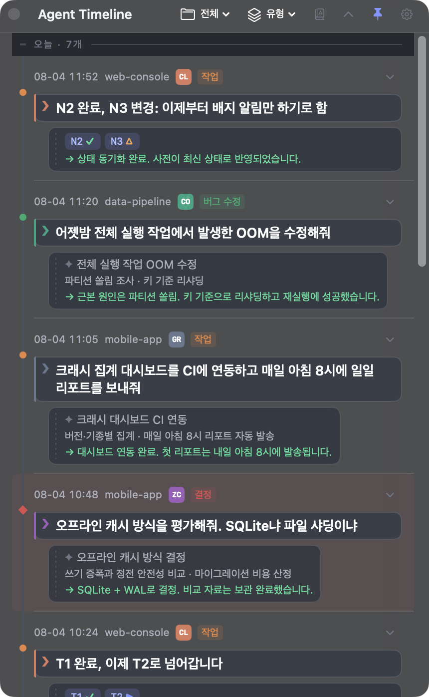
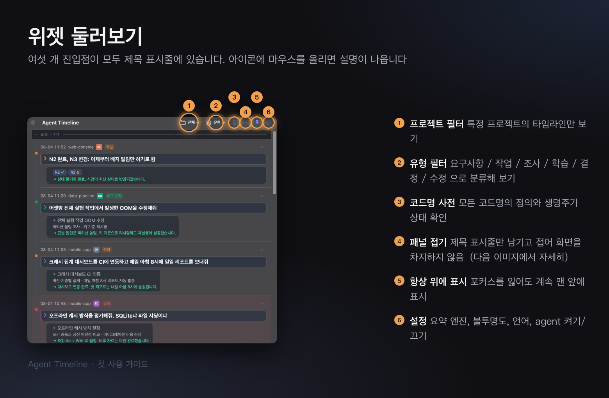
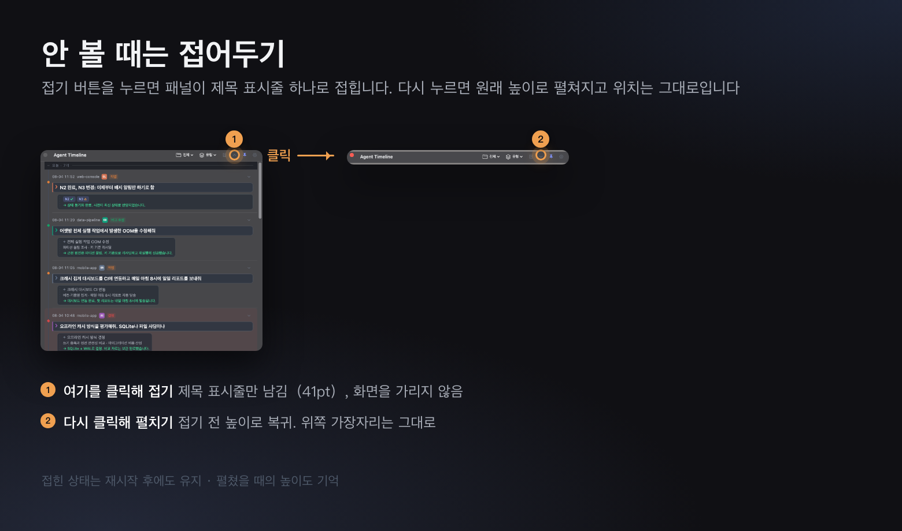
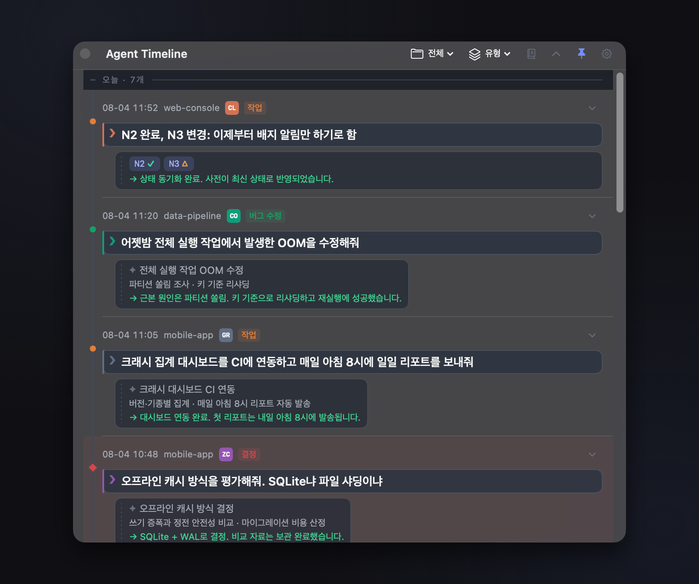
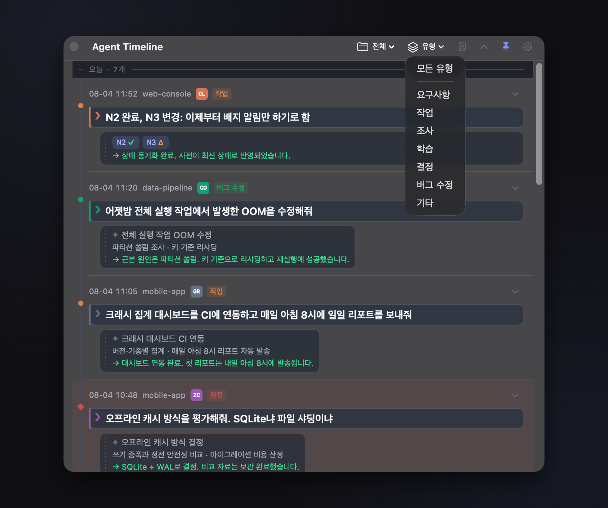
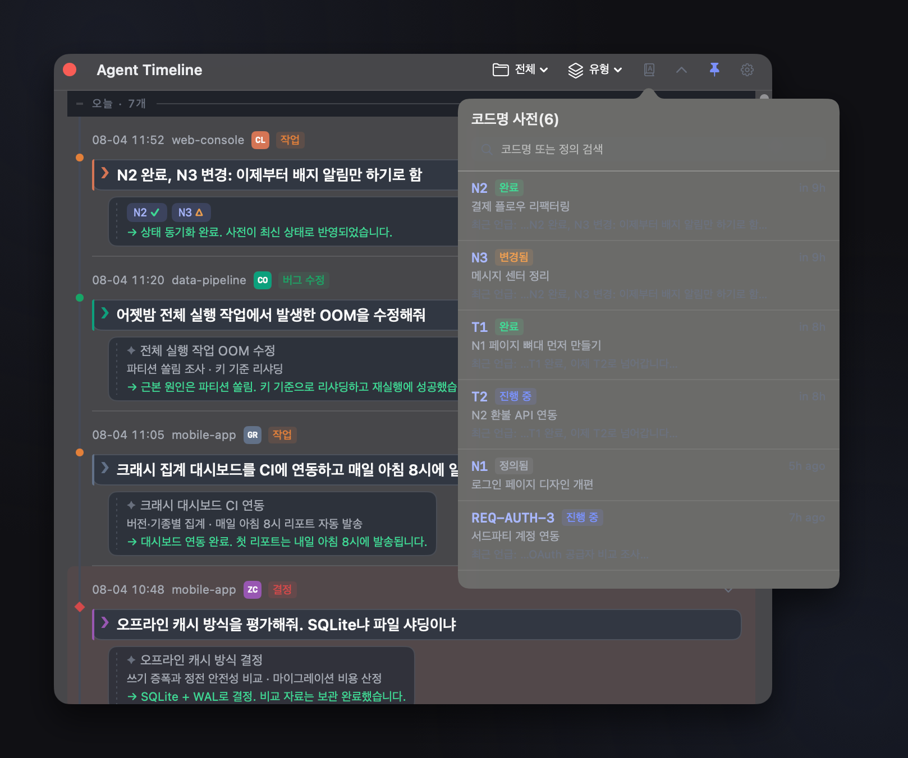
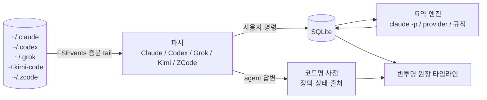

<div align="center">


# Agent Timeline

**바탕화면에 상주하는 반투명 타임라인 위젯 — 긴 호흡의 AI 코딩 세션에서 "내가 했던 말"을 언제든 되짚어볼 수 있게**

[中文](README.md) · [English](README.en.md) · [日本語](README.ja.md) · **한국어**

[](https://github.com/litianyi-007/agent-timeline/actions/workflows/ci.yml)


[](LICENSE)



</div>

---

Claude Code / Codex / Grok Build / Kimi Code / ZCode 같은 agent CLI로 긴 작업을 돌리다 보면 반드시 겪게 됩니다:

> 세션에서 요구사항을 N1, N2, N3… 으로 번호를 매겼는데, 몇 시간 뒤 agent가 **"N2 완료"** 라고 합니다 —— N2가 뭐였더라?
> 수만 줄의 session 로그를 뒤진다? 그만두죠.

**Agent Timeline** 은 로컬 agent의 session 파일을 실시간으로 추적해 **당신이 보낸 모든 명령**을 타임라인 노드로 정리하고, **작업 코드명**을 자동으로 관리되는 사전에 모아둡니다 —— 잊어버렸으면 클릭 한 번이면 됩니다.

## 처음 사용하시나요

<div align="center">





</div>

## 주요 기능

| | |
|---|---|
| 🤝 **5개 agent를 한 타임라인에** | Claude Code · Codex · Grok Build · Kimi Code · ZCode를 함께 표시. 출처 배지(CL/CO/GR/KI/ZC)와 프로젝트 필터 제공. **양 플랫폼의 파서는 한 줄 단위로 동일한 의미론**이라, 같은 자료에서 같은 노드가 나옵니다 |
| 🕰 **명령 타임라인** | 당신의 말 하나 = 노드 하나(최신이 위). LLM이 제목 / 핵심 포인트 / 실행 결과를 한 줄로 요약. 요구사항·작업·조사·학습·결정·수정 으로 분류해 필터링 |
| 📖 **코드명 사전** | `N1: 로그인 개편` 형식의 정의를 자동 등록(명령과 agent 답변 양쪽에서). `N2완료`, `T1 완료, 이제 T2` 같은 표현으로 상태를 자동 전환(✓완료 / ▶진행 중 / △변경). **키워드 검색**으로 코드명·정의·최근 언급을 한 번에 검색. 클릭하면 정의와 출처를 확인 |
| 🫧 **이중 잉크 원장** | `❯ + 실선 컬러 잉크 + 종이 블록` = 당신의 말, `✦ + 점선 회색 잉크` = 기계의 말 —— 포커스를 잃어 반투명해졌을 때 화면에서 유일하게 또렷한 것이 당신이 한 말입니다 |
| 🪟 **위젯다운 창** | 메뉴 막대 / 트레이에 상주. 마우스를 올리면 ≈95%로 읽기 좋고, 포커스가 없으면 ≈25%로 방해되지 않습니다(빠른 페이드인, 느린 페이드아웃). 항상 위 표시 토글, 클릭해도 포커스를 뺏지 않음, 전체 텍스트 선택·복사, 밝든 어둡든 배경에서 대비를 스스로 유지(scrim + 외곽선) |
| 🗂 **제목 표시줄로 접기** | 헤더의 chevron을 한 번 누르면 제목 표시줄만 남고, 다시 누르면 원래 높이로 복귀. **위쪽 가장자리는 움직이지 않아** 롤스크린처럼 동작합니다. 접힌 상태에서는 세로 크기를 잠그며(드래그 불가), 상태와 접기 전 높이는 재시작 후에도 유지됩니다 |
| 🌏 **4개 언어 UI** | 简体中文 · English · 日本語 · 한국어. 설정에서 전환하면 **즉시 적용**됩니다. 상태 키워드와 유형 인식은 **네 언어 모두 항상 활성** —— 한국어 UI에서도 일본어 agent의 답변을 이해합니다. 이미 저장된 기록은 원래 언어 그대로 두고 다시 쓰지 않습니다 |
| 🔌 **설정이 필요 없는 요약** | 기본적으로 로컬의 `claude -p`(대안은 `codex exec`)를 headless로 재사용. 원하면 OpenAI 호환 provider로 교체 가능. LLM을 쓸 수 없을 때는 규칙 기반으로 낮춰 동작하며 끊기지 않습니다 |
| 🔒 **로컬 우선** | session 파싱, 저장(SQLite), 사전이 모두 로컬에 있습니다. 외부로 나가는 요청은 요약 호출뿐입니다 |

## 빠른 시작

### 빌드된 패키지 내려받기

[**Releases**](https://github.com/litianyi-007/agent-timeline/releases) 에 양 플랫폼 산출물이 있습니다(`v*` 태그를 push하면 CI가 자동 빌드):

- `AgentTimeline-macos-vX.Y.Z.zip` — 압축을 풀어 `.app`을 `/Applications`로;
- `AgentTimeline-windows-x64-vX.Y.Z.zip` — 원하는 디렉터리에 풀고 `AgentTimeline.exe` 실행
  (Windows App SDK는 자체 포함. .NET 8 데스크톱 런타임 필요).

버전의 단일 정보원은 저장소 루트의 [`VERSION`](VERSION) 이며, 릴리스 절차는 [CHANGELOG.md](CHANGELOG.md) 상단을 참고하세요.

### macOS (Swift + SwiftUI + AppKit, 서드파티 의존성 없음)

```bash
cd macos
scripts/build-app.sh release              # macos/dist/AgentTimeline.app 생성
cp -R dist/AgentTimeline.app /Applications/
open /Applications/AgentTimeline.app      # 메뉴 막대의 시계 아이콘 ⏱
swift test                                # 106개 단위 테스트
```

### Windows (WinUI 3 / .NET 8)

전체 소스는 [`windows/`](windows/) 에 있으며 **실제 기기에서 동작 확인을 마쳤습니다**: Core 파싱 계층은 크로스 플랫폼 스모크 테스트 463개 어서션을 통과하고, WinUI 계층은 CI의 VS msbuild 하드 게이트를 통과합니다. 계층별 검증 체크리스트는 [windows/DEBUG-PLAYBOOK.md](windows/DEBUG-PLAYBOOK.md)(중국어)를 참고하세요. 개발 빌드는 Visual Studio 2022에서 `windows/AgentTimeline.sln` 을 열면 됩니다. 자세한 내용은 [windows/README.md](windows/README.md).

#### Windows 실제 화면

| 이중 잉크 원장 · 유형 색상 · 코드명 상태 배지 | 프로젝트 드롭다운 · 최근 활동 agent 배지 | 코드명 사전 · 생명주기를 한 화면에 |
|:---:|:---:|:---:|
|  |  |  |

설정 화면(요약 엔진 3종 / 불투명도 / agent 켜기·끄기): [screenshot-windows-settings.png](docs/assets/screenshot-windows-settings.png).

#### macOS 실제 화면

| 이중 잉크 원장 · 유형 색상 · 코드명 상태 배지 | 프로젝트 드롭다운 · 최근 활동 agent 배지 | 코드명 사전 · 생명주기를 한 화면에 |
|:---:|:---:|:---:|
|  |  |  |

설정 화면: [screenshot-macos-settings-ko.png](docs/assets/screenshot-macos-settings-ko.png). 양 플랫폼 모두 동일한 데모 데이터셋([docs/DEMO-DATASET.md](docs/DEMO-DATASET.md), 중국어)으로 촬영했고, 비주얼 사양은 `design/design-tokens.json` 으로 동기화되어 있습니다.

> 같은 데모 데이터, 같은 dip 지오메트리, 같은 배경판으로 촬영해 캔버스 비율이 일치하므로 두 행의 높이가 맞습니다.
> macOS는 **v0.7.6**·Retina 2x(1618×1352), Windows는 v0.6.0·주 화면 100% 배율
> (859×676. dip 지오메트리는 mac과 동일하고 픽셀 밀도는 그 절반). 위에서 사용한 표시 폭 290px에서는 차이가 보이지 않습니다.
>
> ⚠️ **두 행의 버전이 일치하지 않습니다.** macOS 행은 v0.7.6에서 다시 촬영해 사전 패널에 v0.7.6에서 추가된 검색창이 보입니다. Windows 행은 아직 v0.6.0이라 **검색창이 없고, 설정 창도 v0.7.2에서 추가된 로그인 시 자동 실행 토글 이전 상태**입니다. 기능 자체는 양 플랫폼에 모두 있습니다(기능 표 참고). Windows 쪽 스크린샷 재촬영만 남아 있습니다.
>
> ⚠️ **Windows 행은 영어 UI 스크린샷입니다.** 데모 데이터셋은 네 언어가 모두 준비되어 있지만, Windows 실제 기기에서의 한국어 촬영이 아직 이루어지지 않았습니다. 촬영 스크립트는 mac이 `macos/scripts/shots/`, Windows가 `windows/scripts/shots/` 입니다.

## 동작 원리



- **증분 파싱**: 바이트 오프셋으로 tail하기 때문에 재시작해도 다시 읽거나 줄을 흘리지 않습니다. 각 agent의 session 포맷 사양은 [docs/SESSION-FORMATS.md](docs/SESSION-FORMATS.md)(중국어)
- **양 플랫폼 동일 소스**: 비주얼 사양의 단일 정보원은 [design/design-tokens.json](design/design-tokens.json)(mac은 빌드 시 바이너리에 임베드, win은 XAML 리소스로 생성), UI 문구의 단일 정보원은 [design/strings.json](design/strings.json)(74개 키 × 4개 언어). 둘 중 사본이 어긋나면 CI가 바로 막습니다
- 요구사항 문서 [docs/PRD.md](docs/PRD.md) · 아키텍처 [docs/ARCHITECTURE.md](docs/ARCHITECTURE.md) · 변경 이력 [CHANGELOG.md](CHANGELOG.md)

## 설정

메뉴 막대 아이콘 → 설정: 요약 엔진(CLI 모델 / 커스텀 provider), UI 언어, 불투명도 2단계, 항상 위에 표시, 로그인 시 자동 실행, 가져올 일수, 5개 agent 켜기·끄기. 각 agent의 session 경로는 **모두 자동으로 탐색**합니다(설정 항목으로 두지 않았습니다 —— 경로는 사용자 취향이 아니라 제품의 사실이기 때문입니다). 포맷 사양은 [docs/SESSION-FORMATS.md](docs/SESSION-FORMATS.md)(중국어).

## 로드맵

- **M2**: 코드명을 프로젝트 단위 네임스페이스로(프로젝트 간 같은 이름의 짧은 코드를 분리), 사전 관리 화면
- ~~**M3**: Windows 실제 기기 디버깅과 양 플랫폼 비주얼 정합 검수~~ ✅ 완료(2026-07-26. 실제 기기에서 11건 수정, 전체 체크리스트 주석 보존)
- ~~**M4**: mac 쪽 zcode 파서 동기화, Codex 스킬 에코 경로 제거~~ ✅ 완료(2026-07-28). 실제 마우스 조작이 필요한 항목만 담당자 재테스트 대기
- ~~**M4.5**: 4개 언어 UI와 인식 어휘를 양 플랫폼 동일 라운드에 구현~~ ✅ 완료(2026-07-30)
- **M5**: 결과 상세의 리치 텍스트 렌더링(코드 블록 / 표 / 클릭 가능한 링크, 즉 [TEXT-NORMALIZATION Phase D](docs/TEXT-NORMALIZATION.md)).
  **선결 조건**: 먼저 `nodes.full_text` 열 추가가 필요합니다 —— L2 정규화는 되돌릴 수 없고 agent 답변 원문은 현재 저장하지 않아, 과거 노드에는 참조할 원본이 없습니다. 이 열은 동시에 "결과 줄에서 전체 답변 읽기"와 코드명 재생 시 원문 참조(§5.2-1)도 가능하게 합니다.
  M2 뒤에 둔 이유는, 3단계 점진적 공개로 "다 보이지 않는다" 문제가 이미 완화된 반면 열 추가는 되돌릴 수 없는 스토리지 약속이라 검색 요구사항과 함께 결정하는 편이 낫기 때문입니다

## 문서에 대해

이 README와 중국어·영어·일본어 버전은 함께 갱신합니다. [`docs/`](docs/) 아래의 상세 문서(PRD, 아키텍처, session 포맷 사양, 텍스트 정규화 사양, 디버그 playbook)는 **중국어로만** 작성되어 있습니다. 사용자용 문서라기보다 엔지니어링 기록에 가깝기 때문입니다. 특정 문서가 한국어로 필요하다면 어떤 문서가 필요한지 적어 issue를 열어주세요.

## 라이선스

[MIT](LICENSE) © litianyi
