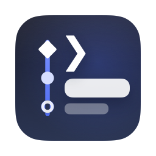
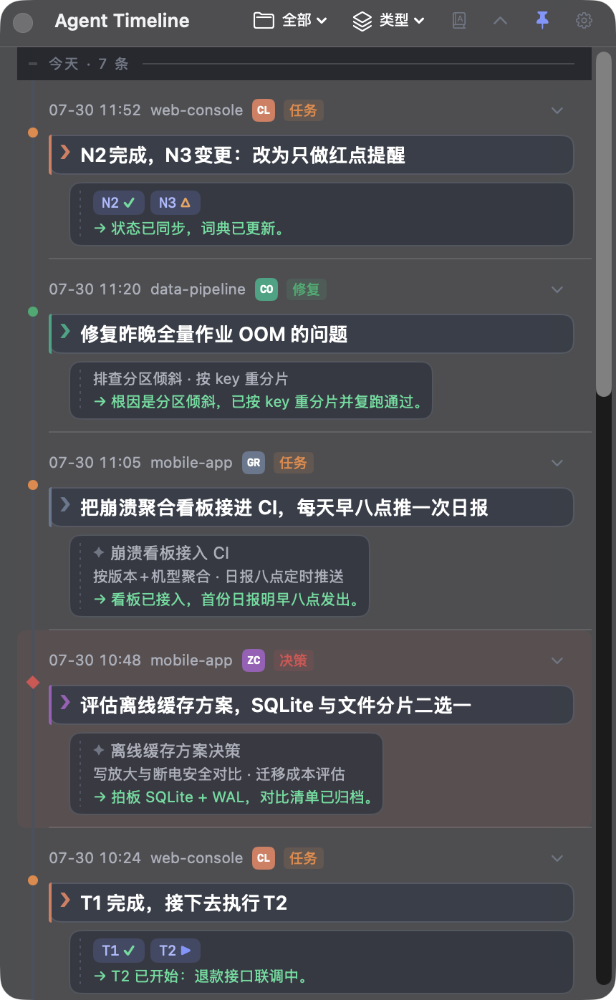
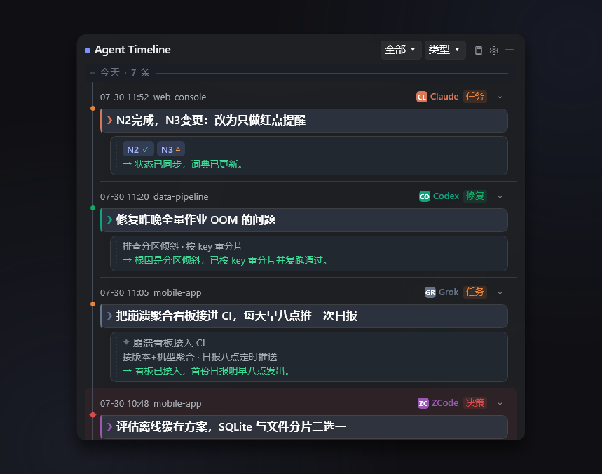
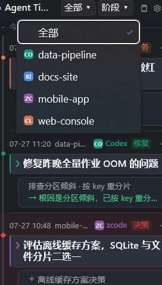
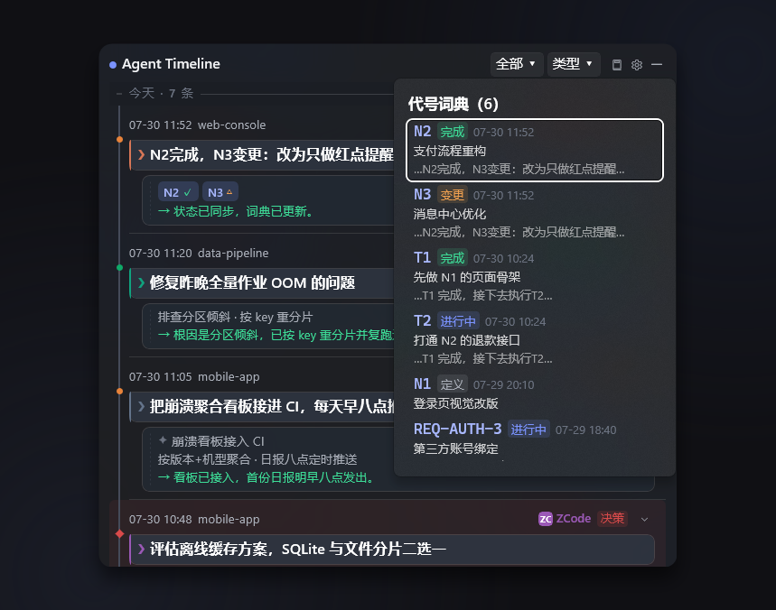
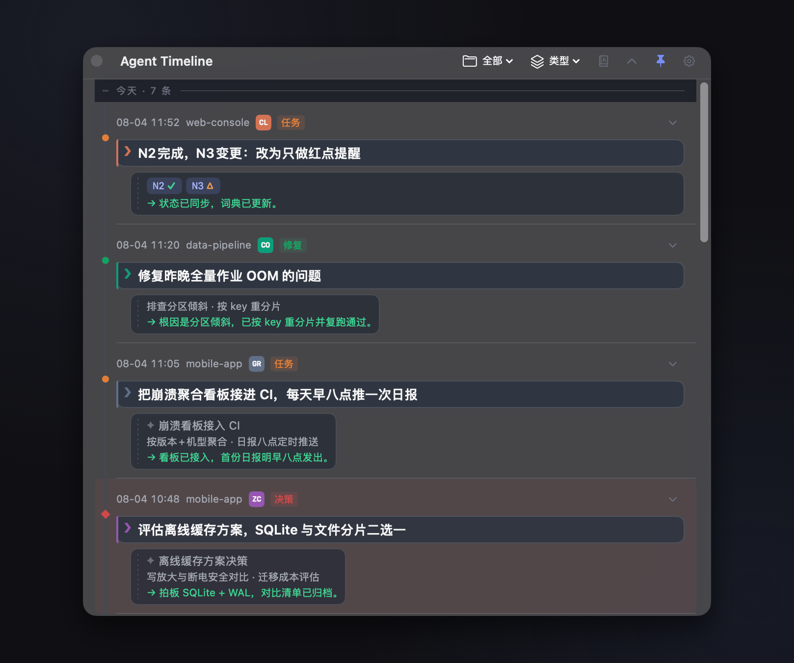
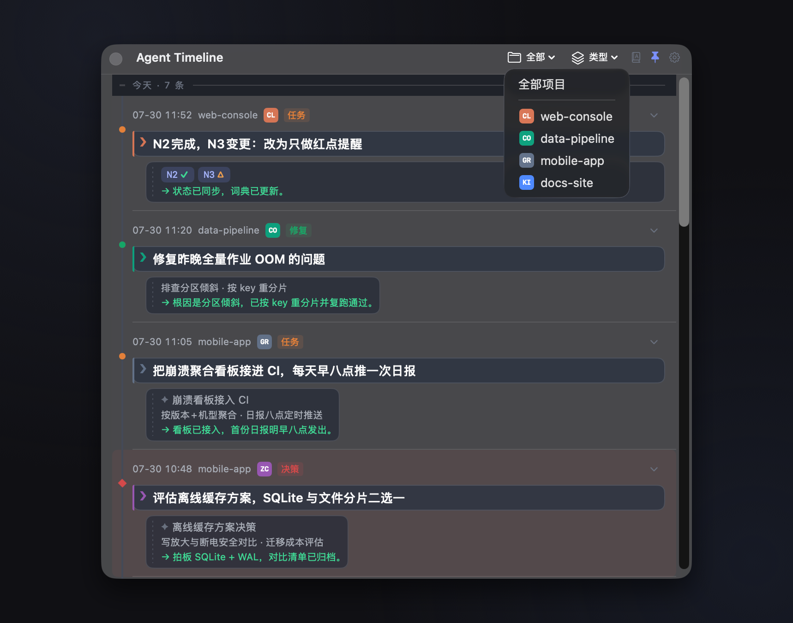
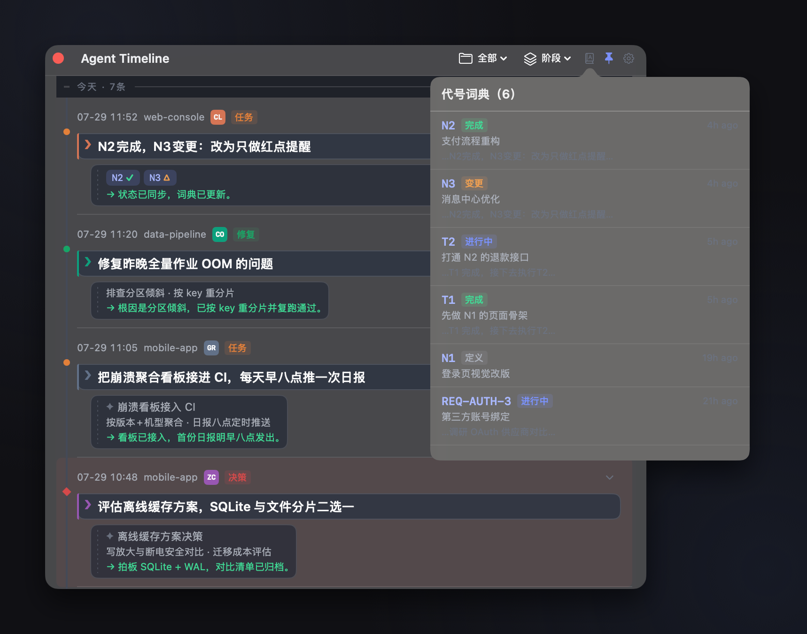
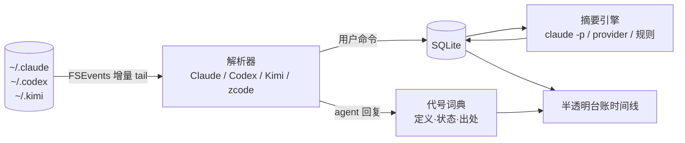

<div align="center">



# Agent Timeline

**常驻桌面的半透明时间线挂件 — 让长周期 AI 编程会话里"你说过的每句话"随时可回溯**

[](https://github.com/surebeli/agent-timeline/actions/workflows/ci.yml)


[](LICENSE)



</div>

---

跟 Claude Code / Codex / Kimi 这类 agent CLI 跑长周期任务时，你一定遇到过：

> 会话里把需求编号成了 N1、N2、N3……几小时后 agent 说 **"N2 完成"** —— N2 是啥来着？
> 翻几万行 session 记录？算了。

**Agent Timeline** 实时跟踪本机 agent 的 session 文件，把**你提交过的每条命令**提炼成时间线节点，把**任务代号**收进一本自动维护的词典 —— 忘了就点一下。

## 核心能力

| | |
|---|---|
| 🕰 **命令时间线** | 每条你的原话 = 一个节点（最新在上），LLM 提炼标题 / 关键点 / 执行结果一句话；按 需求·任务·调研·学习·决策·修复 归类过滤 |
| 📖 **代号词典** | `N1: 登录改版` 式定义自动登记（命令与 agent 回复双通道）；`N2完成`、`T1 完成接下去执行T2` 自动流转状态（✓完成 / ▶进行中 / △变更）；点击回看定义与出处 |
| 🫧 **双墨线台账** | `❯ + 实线彩墨线 + 纸面块` = 你的话，`✦ + 虚线灰墨线` = 机器话 —— 失焦半透明时，屏幕上唯一清晰的就是你说过的话 |
| 🪟 **挂件级窗口** | menu bar / 托盘常驻；hover ≈95% 可读、失焦 ≈25% 不挡事；置顶开关；点击不抢焦点；全文划选复制；任意明暗背景自稳对比（scrim + 描边） |
| 🔌 **零配置摘要** | 默认复用本机 `claude -p`（备选 `codex exec`）headless；可换任意 OpenAI 兼容 provider；LLM 不可用时规则降级不断线 |
| 🔒 **本地优先** | session 解析、存储（SQLite）、词典全部本地；仅摘要调用产生模型请求 |

## 快速开始

### 下载安装包

[**Releases**](https://github.com/surebeli/agent-timeline/releases) 提供双端产物（推 `v*` tag 由 CI 自动构建）：

- `AgentTimeline-macos-vX.Y.Z.zip` — 解压得 `.app`，拖入 `/Applications`；
- `AgentTimeline-windows-x64-vX.Y.Z.zip` — 解压到任意目录运行 `AgentTimeline.exe`
  （自包含 Windows App SDK，需 .NET 8 桌面运行时）。

版本单一事实源为根目录 [`VERSION`](VERSION)，发布流程见 [CHANGELOG.md](CHANGELOG.md) 顶部说明。

### macOS（Swift + SwiftUI + AppKit，零第三方依赖）

```bash
cd macos
scripts/build-app.sh release              # 产出 macos/dist/AgentTimeline.app
cp -R dist/AgentTimeline.app /Applications/
open /Applications/AgentTimeline.app      # menu bar 时钟图标 ⏱
swift test                                # 21 项单测
```

### Windows（WinUI 3 / .NET 8）

完整源码在 [`windows/`](windows/)，**已完成实机运行验证（M3，2026-07-26）**：Core 解析层跨平台
冒烟 112 断言，WinUI 层过 CI 的 VS msbuild 硬门禁，分层验证清单全项注记见
[windows/DEBUG-PLAYBOOK.md](windows/DEBUG-PLAYBOOK.md)。开发构建用 Visual Studio 2022 打开
`windows/AgentTimeline.sln`，详见 [windows/README.md](windows/README.md)。

#### Windows 实机一览

| 双墨线台账 · 阶段彩标 · 代号状态徽章 | 项目下拉 · 最近活跃 agent 徽标 | 代号词典 · 生命周期一屏回忆 |
|:---:|:---:|:---:|
|  |  |  |

设置界面（摘要引擎三档 / 透明度 / agent 开关）：[screenshot-windows-settings.png](docs/assets/screenshot-windows-settings.png)。

#### macOS 实机一览

| 双墨线台账 · 阶段彩标 · 代号状态徽章 | 项目下拉 · 最近活跃 agent 徽标 | 代号词典 · 生命周期一屏回忆 |
|:---:|:---:|:---:|
|  |  |  |

设置界面：[screenshot-macos-settings.png](docs/assets/screenshot-macos-settings.png)。两端同一演示数据集拍摄（[docs/DEMO-DATASET.md](docs/DEMO-DATASET.md)），视觉规范同源 `design/design-tokens.json`。

## 工作原理



- **增量解析**：按字节偏移 tail，重启不重读不丢行；各家 session 格式规范见 [docs/SESSION-FORMATS.md](docs/SESSION-FORMATS.md)
- **双端同源**：视觉规范唯一事实源 [design/design-tokens.json](design/design-tokens.json)（mac 构建期嵌入二进制，win 生成 XAML 资源），CI 强制校验同源
- 需求文档 [docs/PRD.md](docs/PRD.md) · 架构 [docs/ARCHITECTURE.md](docs/ARCHITECTURE.md) · 变更 [CHANGELOG.md](CHANGELOG.md)

## 设置

菜单栏图标 → 设置：摘要引擎（CLI 模型 / 自定义 provider）、透明度两档、置顶、回填天数、agent 开关（zcode 默认监听 `~/.zcode/cli/agents`，可自定义路径；格式规范见 [SESSION-FORMATS §4](docs/SESSION-FORMATS.md)，Windows 解析器已实现、mac 待同步）。

## Roadmap

- **M2**：代号按项目命名空间（跨项目同名短码隔离）、搜索、词典管理界面
- ~~**M3**：Windows 端实机调试与双端视觉对齐验收~~ ✅ 完成（2026-07-26，11 处实机修复 + 全清单注记留档）
- **M4**：mac 端 zcode 解析器同步、真实鼠标交互项人值守复测收尾
- **M5**：结果详情富文本渲染（代码块 / 表格 / 可点链接，即 [TEXT-NORMALIZATION Phase D](docs/TEXT-NORMALIZATION.md)）。
  **前置**：需先加 `nodes.full_text` 列——L2 规整不可逆、agent 回复原文当前不落库，
  历史节点无源可依；该列同时解锁「结果行读完整回复」与代号重放读原文（§5.2-1）。
  排在 M2 之后：三级渐进披露已缓解「看不全」，而加列是不可回退的存储承诺，
  宜与搜索需求一并定夺

## License

[MIT](LICENSE) © litianyi
